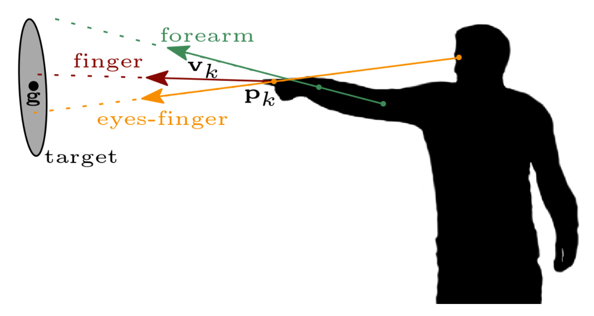
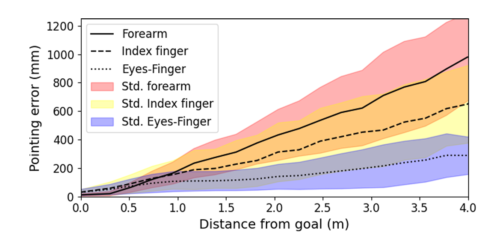

# Meta XR HitsCollider Optimizer


## Overview
This repository enhances the `HitsCollider` method in `com.meta.xr.sdk.interaction@66.0.0` by improving object-pointing accuracy. The original approach uses head and hand frustums to determine the pointed object, which may perform poorly in dense object environments.

Inspired by *Recognition and Estimation of Human Finger Pointing*, this optimization replaces the frustum-based method with a **head-hand extension line** approach and applies a **Gaussian distribution model** to compute the most likely target. This improves precision and stability in VR/AR interactions.

## Features
- Replaces head/hand frustum method with **head-hand extension line**, **body-hand extension line**r.
- Uses a **Gaussian distribution model** for improved pointing accuracy
- More stable interaction in **dense object environments**
- Compatible and tested with `com.meta.xr.sdk.interaction@66.0.0`, but it should also work with other versions.

## Installation
### Prerequisites
Ensure you have the following:
- Unity 2021 or later
- Meta XR SDK (`com.meta.xr.sdk.interaction@66.0.0`)

### Steps
1. Clone the repository:
   ```sh
   git clone https://github.com/DuyutongDockBlocks16/meta-xr-hitscollider-optimizer.git
   ```
2. Replace the cs files to your Unity project:

## Usage
1. Import the modified `HitsCollider` method into your project.
2. Ensure your interaction scripts use the updated pointing algorithm.
3. Adjust the Gaussian parameters(sigma) in the settings for optimal accuracy.

## Contributing
We welcome contributions! Follow these steps:
1. Fork the repository.
2. Create a new branch for your feature/fix:
   ```sh
   git checkout -b feature-improve-pointing
   ```
3. Commit your changes:
   ```sh
   git commit -m "Improved Gaussian model for pointing accuracy"
   ```
4. Push to your branch and create a pull request.

## Acknowledgments
This project was inspired by the research paper:

**"Recognition and Estimation of Human Finger Pointing with an RGB Camera for Robot Directive"**

By **Eran Bamani, Eden Nissinman, Lisa Koenigsberg, Inbar Meir, Yoav Matalon, and Avishai Sintov**.

Greatly appreciate their work in advancing finger pointing estimation techniques.

## Contact
For any questions or discussions, feel free to open an issue or contact me via GitHub!

# Technical Principles

## Overview
This part explains the technical principles behind our optimization of the `HitsCollider` method in `com.meta.xr.sdk.interaction@66.0.0`. Our approach is inspired by the findings of *Recognition and Estimation of Human Finger Pointing with an RGB Camera for Robot Directive* and aims to improve object-pointing accuracy in VR/AR environments.

All the pictures used this part is provided by the paper **"Recognition and Estimation of Human Finger Pointing with an RGB Camera for Robot Directive"**

## Human Pointing Methods
The referenced research paper discusses three primary human pointing methods:

1. **Finger Pointing** - The direction is determined solely by the index finger orientation.
2. **Forearm Pointing** - The pointing direction is calculated based on the forearm’s alignment.
3. **Eyes-Finger Pointing** - The pointing direction is derived from the alignment between the user’s eyes and the pointing finger.


Among these three methods, **Eyes-Finger Pointing** demonstrated the best performance in terms of both accuracy and lower standard deviation of error. This suggests that the natural coordination between eye gaze and finger position provides a more reliable pointing estimation.

