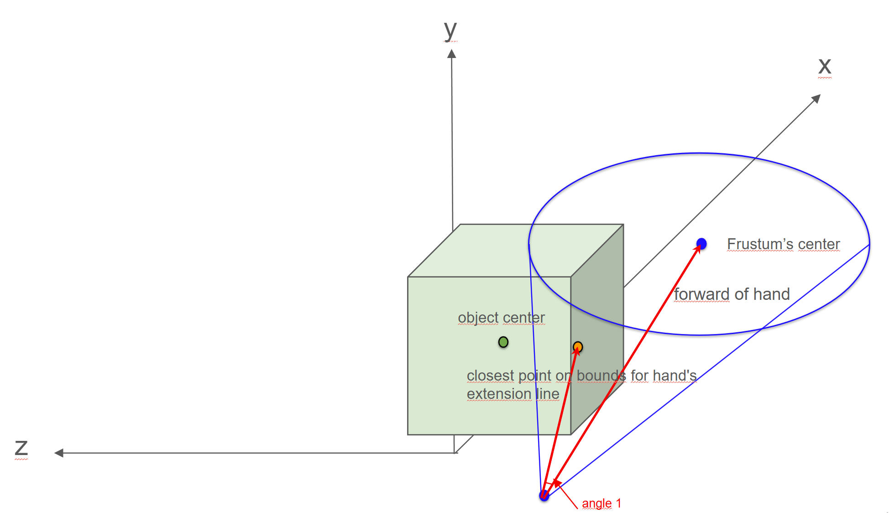
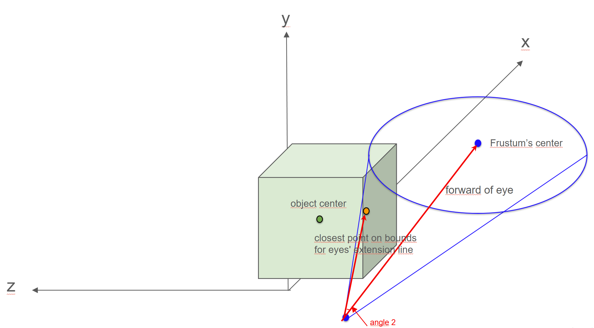
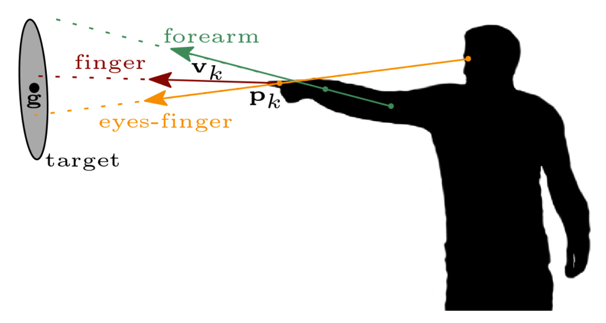
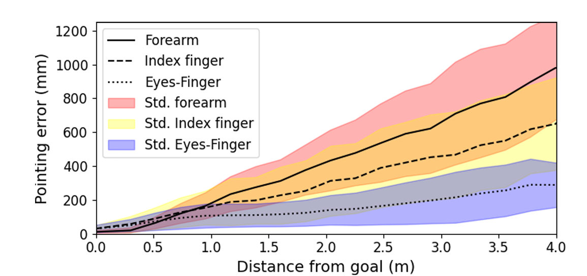

# Technical Principles

## Overview
This part explains the technical principles behind our optimization of the `HitsCollider` method in `com.meta.xr.sdk.interaction@66.0.0`. Our approach is inspired by the findings of *Recognition and Estimation of Human Finger Pointing with an RGB Camera for Robot Directive* and aims to improve object-pointing accuracy in VR/AR environments.

Some pictures used this part is provided by the paper **"Recognition and Estimation of Human Finger Pointing with an RGB Camera for Robot Directive"**

## Native Pointing Method
The original `HitsCollider` method determines which object a user is pointing at by utilizing two independent cones:

1. **Hand Cone** - Originates from the user's hand and extends in the direction of the hand.
2. **Head Cone** - Originates from the user's eyes and extends in the direction of the gaze.

Each cone independently computes a score for potential target objects. The final pointing determination is made using a weighted average of these scores, where the **head cone contributes 80%** of the weight and the **hand cone contributes 20%**. 

Additionally, when calculating the angle between the pointing direction and the object, the method does not rely solely on the object's center point. Since object sizes are not uniform, it first determines the **closest point on the object's bounds** to the cone's central axis before performing the angle computation.

### For Example:
**hand(Hand Cone)**

**eyes(Head Cone)**

Next, normalising the angle1 and angle2, and calculating weighted average

This method works well in sparse environments but struggles in dense object scenarios where overlapping cones make accurate object selection difficult.

## Human Pointing Methods
The referenced research paper discusses three primary human pointing methods:

1. **Finger Pointing** - The direction is determined solely by the index finger orientation.
2. **Forearm Pointing** - The pointing direction is calculated based on the forearm’s alignment.
3. **Eyes-Finger Pointing** - The pointing direction is derived from the alignment between the user’s eyes and the pointing finger.

Among these three methods, **Eyes-Finger Pointing** demonstrated the best performance in terms of both accuracy and lower standard deviation of error. This suggests that the natural coordination between eye gaze and finger position provides a more reliable pointing estimation.

## Gaussian Probability-Based Scoring
The study *Exploration of Bare-Hand Mid-Air Pointing Selection Techniques for Dense Virtual Reality Environments* indicates that when users point at distant objects, their pointing accuracy follows a Gaussian distribution. Inspired by this observation, our optimization method incorporates a **Gaussian probability model** to compute the final object scores. 

Instead of treating the pointing direction as a strict geometric ray, we model it as a probabilistic distribution, where the likelihood of an object being selected is influenced by its distance from the expected pointing trajectory. This approach helps to mitigate errors caused by hand tremors or slight misalignments, improving the robustness of object selection in dense virtual environments.